# Házi feladat specifikáció

Információk [itt](https://viauac00.github.io/laborok/hf)

## Mobil- és webes szoftverek
### 2022.10.16
### Chat
### Vörös Asztrik - (WYZJ90)
### asztrik35@gmail.com
### Laborvezető: Pásztor Dániel

## Bemutatás

Az alkalmazás egy minimalista chat funkciót fog megvalósítani, bejelentkezéssel, regisztrációval, felhasználó hozzáadással, üzenetküldéssel 2 személy között. Azért ezt választottam, mert kíváncsi voltam mennyire nehéz megvalósítani egy működőképes chat alkalmazást a tárgy ismereteivel.

## Főbb funkciók

- Lehetőség van regisztrálni egyedi felhasználónévvel, illetve teljes névvel, jelszóval.
- Lehetőség van bejelentkezni felhasználónév-jelszó párossal, a bejelentkezés nem csak az adott sessionre vonatkozik.
- Lehetőség van a chat partnereinket áttekinteni: teljes név, legutolsó üzenet preview, legutolsó üzenet dátuma, teljes név 2 betűs monogramját megjelenítő profilkép.
- Lehetőség van új chat partner felvételére a helyes felhasználónév megadásával.
- Lehetőség van kijelentkezni.
- Lehetőség van a chat partnerrel chatelni közel real time.

## Választott technológiák:

- UI
- Fragmentek
- RecyclerView
- Hálózati kommunikáció

# Házi feladat dokumentáció (ha nincs, ez a fejezet törölhető)
## Funkcionalitás
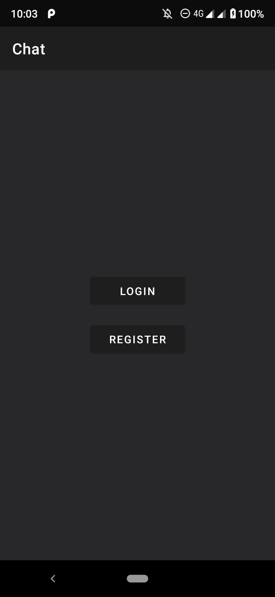

Az sötét témájú alkalmazásban lehetőség van egyedi felhasználónévvel regisztrálni.

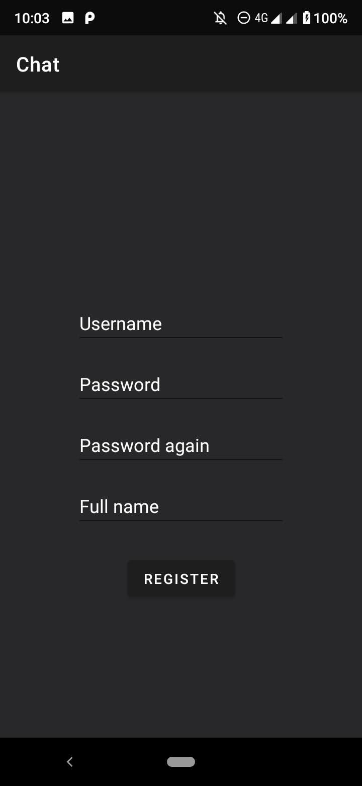
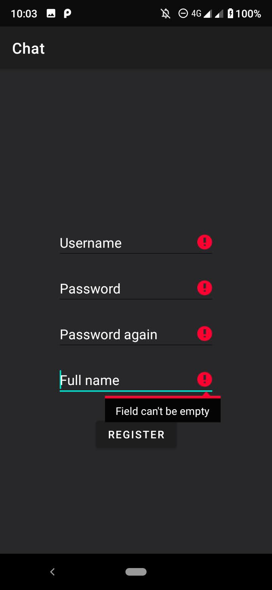

Ha nem volt foglalt a felhasználónév akkor folytathatjuk a bejelentkezéssel.

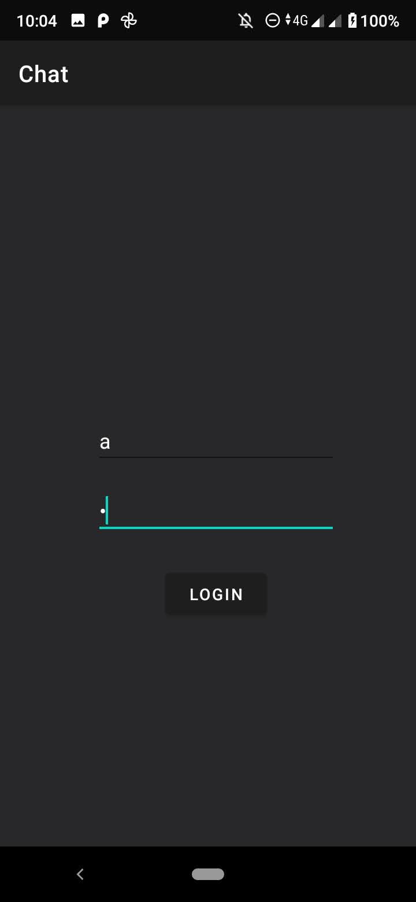

A bejelenetkezés által kapott token az alkalmazás újraindulása után is tárolva marad, így ilyenkor már a kapcsolatok nézet nyílik meg alapból.

A kapcsolatok nézetben látszódnak a felvett ismerősök listája
- Ismerős teljes neve
- Ismerős teljes néven alapuló profilképe
- Ismerősnek küldött legutolsó üzenet tartalma (ha nincs nem jelenik meg)
- Ismerősnek küldütt legutolsó üzenet ideje (ha nincs nem jelenik meg)

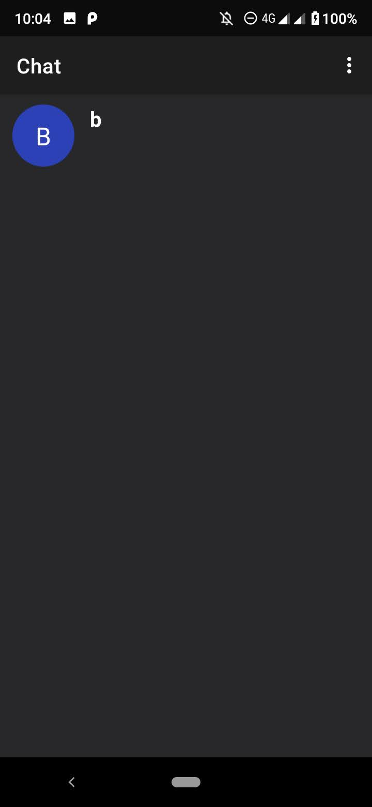
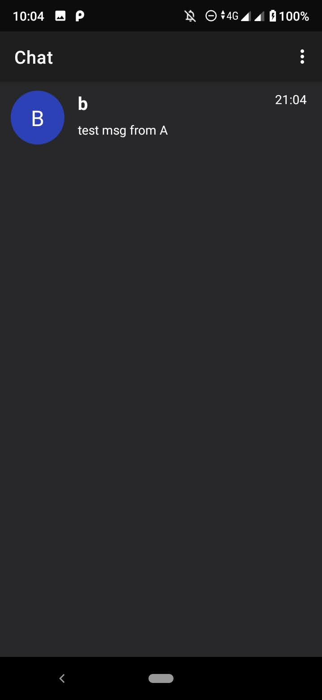

Egy kapcsolatot kiválasztva megjelenik az üzenetek nézet.
Az üzenetek nézetben lehetőség van üzenetet küldeni a másik személynek, ami Websocket alapon azonnal, gyorsan és kis adatforgalmat generálva megjelenik a másik oldalon.

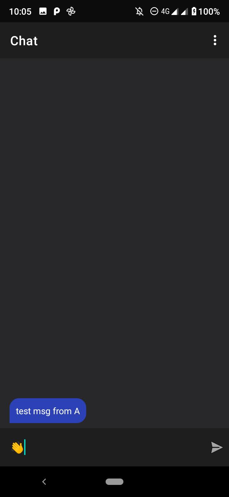
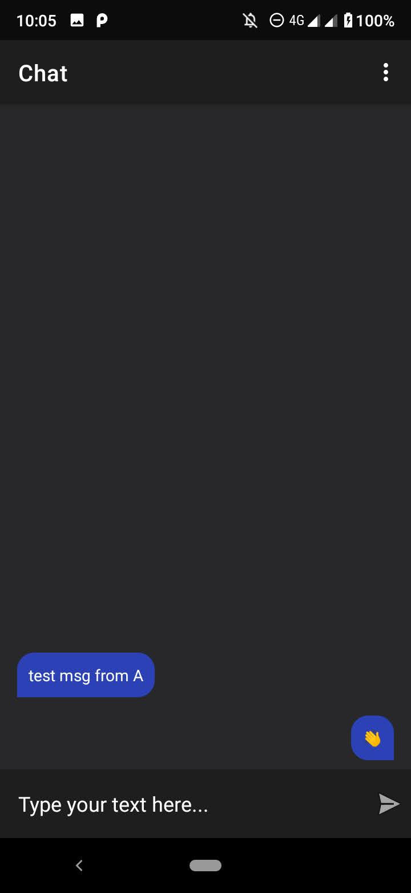
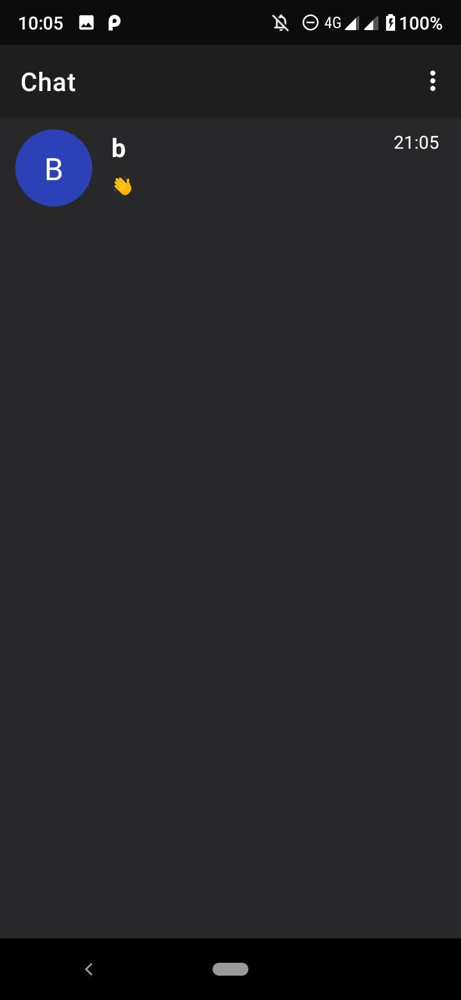

Bejelentkezett állapotban lehetőségünk van bármikor kijelenetkezni. Ilyenkor visszakerülünk az első nézethez, ahol van lehetőségünk bejelentkezni, illetve regisztrálni.

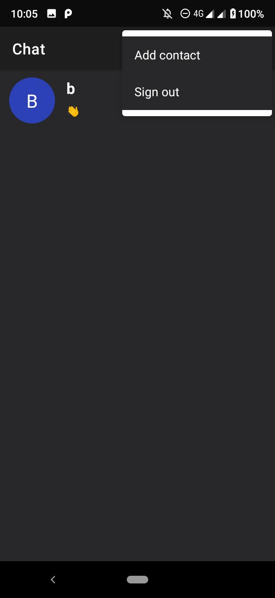

Szintén lehetőségünk van bejelentkezett állapotban ismerőst felvenni a kapcsolati listába, csak ismernünk kell hozzá a felhasználónevét. Természetesen magunkat, illetve már felvetteket nem tudunk felvenni, erről figyelmeztet az alkalamzás.

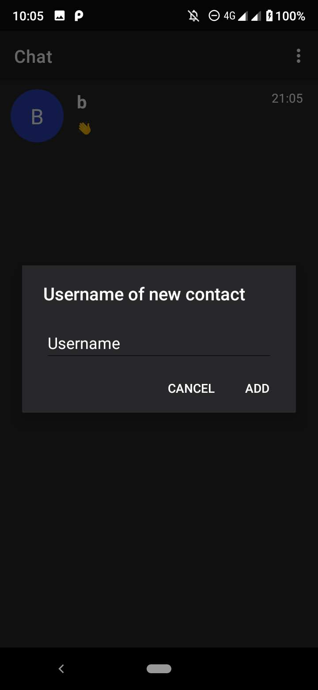

Ha aközben kapunk új üzenetet miközben a kapcsolatok nézetben vagyunk, akkor annak tartalma websocket technológiával frissül.

## Érdekesebb megoldások
Websocket kapcsolat segítségével az üzeneteket valós időben tudjuk küldeni és fogadni, melyek a kapcsolatok nézetben is frissülnek.

Szintén az új kapcsolatok is valós idejűen érkeznek, tehát ha valaki hozzáad minket a kapcsolati listájához, akkor a kapcsolatok listában számunkra azonnal megjelenik.

Az üzenetek nézetben ha nem a RecyclerView alján vagyunk, akkor nem fog legörgetni minket a legutolsó üzenethez.

Session tárolásra kerül, mely újraindulás esetén azt jelenti, hogy ha bejelenetkezve vagyunk, akkor a kontakt nézet jelenik meg először, nem a bejelentkezést és regisztrációt felkináló nézet. A session token minden kéréshez HTTP fejlécként hozzáadódik.

Az input validációkra készítettem segédfüggvényeket, hogy minél kevesebb kódismétlődés legyen.

## Egyéb
- A backend sajnos nem támogatja azonos user több eszközről való belépését websocket szempontból.
- A backend jelenleg konténerizálva fut egy szerveren, ahol az óra 1 órát késik.
- A backend forráskódja is csatolva van, ha esetleg valamiért nem lenne elérhető. Ilyenkor az új ip címet fel kell venni a res/xml/network_security_config.xml-be, illetve a network/NetworkManager DOMAIN változóját is frissíteni kell (ip + port). De lehet egyszerűbb ha írsz és ránézek :).
- Előre elkészített fiókok (felhasználónév/jelszó): a/a, b/b
